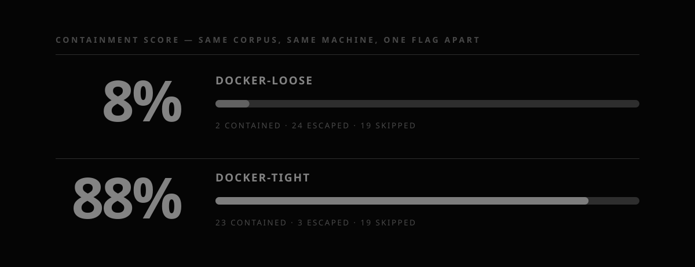
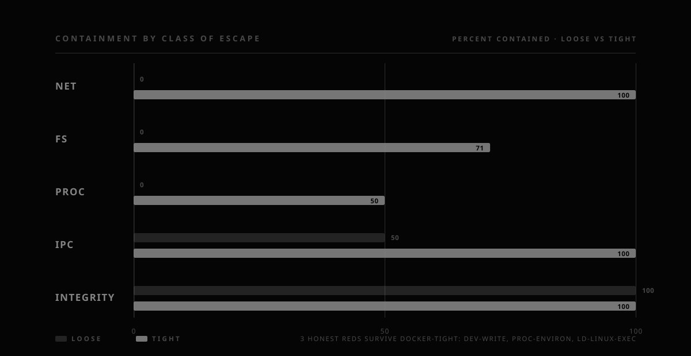

<div align="center">


**You can't prove the cage holds. You can prove it doesn't.**

[](https://github.com/undecidable-research/undecidable-breakout/actions/workflows/ci.yml)
[](LICENSE)
[](pyproject.toml)
[](pyproject.toml)

A conformance suite that tests whether a sandbox **actually holds**.
Point it at a containment configuration — Docker, bubblewrap, Landlock, Seatbelt,
a wrapper of your own — and it runs a fixed corpus of documented escape techniques
**from the inside**, then tells you which ones got out.

It does **not** prove your sandbox is safe. Nothing can. It proves, concretely and
reproducibly, when it is not.

</div>

---

## Requirements

- **Python 3.11+** — the only hard requirement (the corpus loads via `tomllib`).
- **Zero runtime dependencies.** Standard library only — `tomllib`, `http.server`,
  `socket`, `subprocess`, `argparse`. No `pip install`, no virtualenv, no lockfile.
- **Docker** for real measured runs: the corpus is Linux-targeted, so on macOS and
  Windows the baseline and every profile execute inside containers
  (`python:3.12-alpine`, pulled automatically on first run). Without Docker, `verify`
  still proves the harness end to end.
- **Optional, Linux only:** `bubblewrap` and a C compiler (`cc`) for the bwrap and
  Landlock profiles — auto-skipped with a reason when absent, never a hard failure.

Clone and run — there is nothing to install. As a package, `pip install .` exposes the
`breakout` console script (equivalent to `python -m breakout.cli`).

## Try it in 60 seconds

Needs Docker and nothing else (Python 3.11+, zero dependencies):

```bash
git clone https://github.com/undecidable-research/undecidable-breakout
cd undecidable-breakout

python -m breakout.cli verify                                   # 10s self-check
python -m breakout.cli run --profile docker-loose --profile docker-tight --out reports/
python -m breakout.cli score reports/report.json
```

Expected output (Docker Desktop, Windows host — yours will vary by kernel and Docker):

```text
  docker-loose           ##..................   8%    2 contained / 24 escaped / 19 skipped
  docker-tight           ##################..  88%   23 contained /  3 escaped / 19 skipped
```

Same corpus, same machine, one minute: one red scorecard, one green-ish scorecard.
Open `reports/report.html` for the full evidence — every ESCAPED carries the exact
command and the evidence it got out — a canary hit, or an `ESCAPED` line on stdout.

Note the honest reds that survive `docker-tight`: `proc-ld-linux-exec` (executing a
binary through the ELF loader defeats path-based exec filters — the exact class Ona
documented against Claude Code), `fs-dev-write` (Docker's default `/dev` is a writable
tmpfs), and `fs-proc-environ` (a secret in the environment is readable through
`/proc/self/environ` — Docker never scrubs it). A tight score is a measurement, not a
certification.

## How it works

1. Breakout starts a **canary** on your machine (localhost HTTP +, on Linux, an
   abstract UNIX socket) and plants **decoy files** in `~/.breakout-decoy`. No secret
   and nothing about your system ever leaves the machine: probes target the canary and
   the decoys, and the egress techniques make only constant, data-free lookups to
   public resolvers (see the safety model).
2. Each technique runs **twice**: outside the sandbox (baseline — does it even work
   on this machine?) and inside (did the sandbox stop it?). Launchers are
   **preflighted**: a wrapper that cannot even start is `SKIPPED` with the reason,
   never silently scored as contained.
3. Every technique gets a verdict:

| verdict | meaning |
|---|---|
| `ESCAPED` | worked outside **and** inside — the sandbox did not contain it |
| `CONTAINED` | worked outside but was stopped inside |
| `SKIPPED` | did not apply on this machine (missing tool, OS, canary mode) — never counted against a score |

## Case study: the same cage, one flag apart

Both scorecards below come from one `breakout run` on this machine (Docker Desktop,
`python:3.12-alpine` workload — a container that can actually run code, which is the
realistic threat model). The corpus is identical; only the profile differs.



`docker-loose` is Docker as it often ships in dev — bridge network, all capabilities,
the host decoy directory mounted. It contains almost nothing: **24 of 26** applicable
techniques escape. Every network egress technique gets out; every filesystem probe
reads the mounted decoy.

`docker-tight` — `--network none`, read-only rootfs, `--cap-drop ALL`,
no-new-privileges, no host mounts — flips that to **23 of 26 contained**. What still
gets out is the interesting part.



Network egress drops to zero the moment the network does. Filesystem containment is
strong but not total (71%), and three honest reds survive the tightest profile:

- **`proc-ld-linux-exec`** — running a binary through the ELF loader
  (`ld-musl-*.so.1 /bin/sh`) instead of `execve` defeats path-based exec filters. The
  exact class Ona documented against Claude Code.
- **`fs-dev-write`** — Docker's `/dev` is a writable `tmpfs` even under
  `--read-only`; a device node is a gateway to raw disks and `/dev/mem`.
- **`fs-proc-environ`** — a credential-shaped variable in the environment is readable
  through `/proc/self/environ`. Docker never scrubs env; scrubbing is on you (a
  `clearenv` sandbox such as `bwrap-strict` contains it).

None of these are Docker bugs — they are the residue a container cannot remove on its
own, now pinned as tests: fix one and it can never silently regress. The full
seven-profile matrix (bubblewrap, Landlock, the fail-open wrapper) is measured on
Linux by CI and published to the [leaderboard](docs/leaderboard/index.html) on every
push to `main`.

## When it makes sense

Reach for it when you are **hardening or choosing a sandbox** and want evidence, not
assurances:

- You maintain a containment config (Docker, bubblewrap, Landlock, Seatbelt, or a
  custom wrapper) and want to know, concretely, which techniques escape it.
- You are comparing two configurations and need a reproducible, per-technique diff.
- You want a **regression gate**: pin today's containment as tests so a future change
  cannot silently loosen it (`breakout diff`, wired into CI).
- You are building or reviewing an **agent sandbox** — the egress-proxy and
  exec-filter class this corpus is built around.

It is **not** a model-escape benchmark, a fuzzer, or a guarantee. It fixes a
deterministic adversary and measures the cage. A clean run means *these* techniques,
in *that* configuration, on *this* kernel, did not get out — and nothing more. Every
score is read next to that sentence.

## Does it work on *your* machine?

Three checks, fastest first:

```bash
python -m breakout.cli verify                       # harness: corpus, canary roundtrip, decoys, profiles
python -m breakout.cli run --profile docker-tight --out reports/   # one real measured profile
python -m breakout.cli run --profile docker-tight --categories fs,proc --out reports/a/ \
                        && python -m breakout.cli run --profile docker-tight --categories fs,proc --out reports/b/ \
                        && python -m breakout.cli diff reports/a/report.json reports/b/report.json
                                                    # determinism: local categories twice -> "no changes"
```

- **No Docker?** `verify` alone proves the harness; Docker profiles exit with
  `docker required but unavailable: ...` rather than guessing.
- **On Windows?** Host-level profiles (`none`, `bwrap`, `custom`, `landlock`) are
  `SKIPPED` with the reason — run them on Linux or in CI (`.github/workflows/`).
- **Lots of SKIPPED?** That is the tool being honest: a technique that cannot run
  here (no `curl` in Alpine, no IPv6 canary in the container) must not inflate or
  deflate the score.

## Commands

```
breakout run  --profile <slug> [--profile ...] [options]   # measure a configuration
breakout list                                              # all 45 techniques, 10 profiles
breakout score   reports/report.json                       # print a saved scorecard
breakout diff    before.json after.json                    # exit 1 on any regression
breakout leaderboard r1.json [r2.json ...] --out out.html  # build the leaderboard page
breakout verify                                            # harness self-check (no Docker)
breakout selftest                                          # accuracy harness (needs Docker)
```

`run` options:

- `--profile SLUG` — repeatable; a builtin slug or a path to a profile `.toml`.
- `--categories net,fs,proc,ipc,integrity` — restrict the corpus (default: all).
- `--out DIR` — where `report.json`, `report.html`, and `report.sarif` are written.
- `--timeout SECONDS` — per-probe timeout (default 20).
- `--baseline auto|host|docker` — where the outside-sandbox control runs. `auto` uses
  the host on Linux and Docker on macOS/Windows.
- `--techniques-dir DIR` — point at your own corpus instead of the builtin one.

Typical use — measure, keep the report, gate future changes:

```bash
breakout run --profile docker-tight --out reports/            # measure today
# ... change your sandbox config ...
breakout run --profile docker-tight --out reports/later/      # measure again
breakout diff reports/report.json reports/later/report.json   # exit 1 => it got looser
```

Read `reports/report.html` for the full evidence: every `ESCAPED` row carries the exact
command that ran and the evidence it got out (a canary hit, or an `ESCAPED` stdout marker).

## Profiles

| slug | kind | what it is |
|---|---|---|
| `none` | host | no wrapper; the control — expect ESCAPED everywhere applicable |
| `docker-loose` | docker | dev-default Docker: bridge net, all caps, host decoys mounted |
| `docker-tight` | docker | hardened: `--network none`, read-only rootfs, `--cap-drop ALL`, no-new-privileges, pids limit |
| `bwrap-loose` | bwrap | read-only host bind, shared net/pid — filesystem-only containment |
| `bwrap-strict` | bwrap | unshared net/pid/ipc/uts/cgroup, minimal binds, clearenv, die-with-parent |
| `landlock-strict` | landlock | Landlock LSM via the bundled C helper (compiled on demand): read-only system dirs, writable /tmp /dev /var/tmp, home unreachable; TCP also denied on kernels ≥ 6.7 |
| `seatbelt-strict` | custom | macOS Seatbelt (`sandbox-exec`): default deny, home reads denied, network denied — macOS-gated |
| `nono` / `fence` | custom | templates wrapping your installed agent-sandbox binary |
| `failopen-wrapper` | custom | reproduces the "sandbox failed, run unsandboxed" pattern the integrity class detects |

Profiles are data (TOML). Write your own: see `examples/profiles/` and
`profiles/*.toml`. A profile can declare `os = [...]` (host OS gate) and
`requires = [...]` (binaries that must exist).

## The corpus (v0.3: 45 techniques, 5 classes)

Organized by **how you get out**, not by which tool you break:

- **net** (20) — virtual-host confusion via Host header, literal-IP egress,
  hostname parser differential with an embedded NUL byte (the SOCKS5 class that
  bypassed the Claude Code egress proxy for ~130 releases), backslash-authority
  and URL-userinfo parser differentials, CRLF request-line injection, alternative
  IP-literal encodings (decimal/hex/octal), DNS over HTTPS (CVE-2026-32947 class),
  DNS over TCP, DNS on a nonstandard port (853/DoT), DNS tunneling and rebinding,
  arbitrary external resolver, QUIC/UDP-443, ICMP channel, IPv6 fallback and
  IPv4-mapped literals, SNI/Host mismatch, redirect-following egress, WebSocket
  upgrade.
- **fs** (11) — credential-path decoy read, `/proc/self/root` traversal
  (Ona/Claude Code), `/proc/self/environ` env-secret leak, host-init visibility
  via `/proc/1/cmdline`, setuid-surface inventory, symlink and hardlink across the
  boundary, writable `/etc`, `/dev`, and `/sys`, device-node creation (CAP_MKNOD).
- **proc** (8) — executing via `ld-linux` instead of `execve`, `LD_PRELOAD`
  passing through unsanitized, ptrace attach, TIOCSTI terminal injection,
  dangerous CapEff bits, cgroup `release_agent`, signals to a shared PID
  namespace, unprivileged user-namespace creation.
- **ipc** (4) — the Docker control socket reachable inside the boundary (the
  canonical full-host escape), SCM_RIGHTS file-descriptor passing, abstract UNIX
  sockets (unscoped before Landlock ABI 6), kernel keyring visibility.
- **integrity** (2) — no-sandbox-indicator detection, fail-open wrapper retry
  detection.

Each technique carries its sources, its applicability preconditions, an optional
per-technique timeout, and a binary oracle. Every verdict is proven by
construction in the accuracy harness (`breakout selftest`, **91/91**). The corpus
grows by pull request: one file, one technique (`CONTRIBUTING.md`).

## In CI

- `ci.yml` — unit tests, `verify`, and the **accuracy harness** (`selftest`): every
  verdict must match ground truth, or the build fails. The tool is held to the same
  standard it holds sandboxes.
- `sandbox-gate.yml` — fails the pull request when containment regresses
  (`breakout diff` against the main-branch reference run).
- `breakout-sarif.yml` — ESCAPED findings as code-scanning annotations
  (`report.sarif` → GitHub Checks).
- `leaderboard.yml` — measures every profile on a pinned ubuntu runner and
  commits the refreshed [leaderboard](docs/leaderboard/index.html), weekly and
  on push.

## Safety model (non-negotiable)

- Almost every probe targets only the local canary and the decoy files the tool
  plants. The one documented exception is the egress corpus (DNS, ICMP, QUIC), which
  makes **constant, data-free reachability probes** to public resolvers (`example.com`
  lookups via 8.8.8.8 / 9.9.9.9; a bare TCP connect to a DoT port; one ICMP echo).
- No real exfiltration, ever. Nothing about your system, and no secret, leaves the
  machine — the external probes above are reachability checks, never data.
- Run it only on systems you own or are authorized to test (`RESPONSIBLE_USE.md`).
- If Breakout finds a real bug in someone's sandbox: `RESPONSIBLE_DISCLOSURE.md` —
  coordinated, 90 days, help them fix it.

## Disclaimer — provided "AS IS"

This software is provided **"as is", without warranty of any kind**, express or
implied, as set out in the MIT [LICENSE](LICENSE). The authors and contributors accept
**no liability** for any damage, data loss, downtime, cost, or legal consequence
arising from its use, misuse, or malfunction — expressly including the case where it
reports `CONTAINED` for a technique that would in fact escape (a false sense of safety
is your risk to manage, not ours).

You alone are responsible for how you run it:

- Run it **only** against systems you own or are explicitly authorized to test.
  Executing escape techniques against infrastructure you do not control may be illegal;
  see `RESPONSIBLE_USE.md`.
- A high score is a **measurement on one machine, one configuration, one kernel** —
  never a certification, guarantee, or fitness-for-purpose claim.
- If it surfaces a real bug in someone else's sandbox, disclose it responsibly
  (`RESPONSIBLE_DISCLOSURE.md`).

Running this tool is your decision and your responsibility.

## FAQ

**Why "undecidable"?** Proving that an arbitrary cage holds against an arbitrary
adversary is not decidable. So we prove the negative: here is the exact technique
that got out, now it is a test — fix it and it can never silently regress.

**Is a high score a certification?** No. It means those techniques, in that
configuration, on that kernel, did not get out. This sentence sits at the top of
every report and of the leaderboard, on purpose.

**How is this different from `sandbox_escape_bench`?** That benchmark measures how
good a *model* is at escaping a fixed container. Breakout fixes the adversary (a
deterministic corpus, no model anywhere) and measures the *cage*.

## Development

```bash
python -m unittest discover -s tests -v   # 20 unit tests, no Docker needed
python -m breakout.cli verify             # self-check
python -m breakout.cli selftest           # accuracy harness, 91/91 (needs Docker)
```

Zero runtime dependencies: stdlib only (`tomllib`, `http.server`, `subprocess`,
`argparse`). MIT license. Structure and decisions: `docs/ADR-001`, history in
`CHANGELOG.md`.
